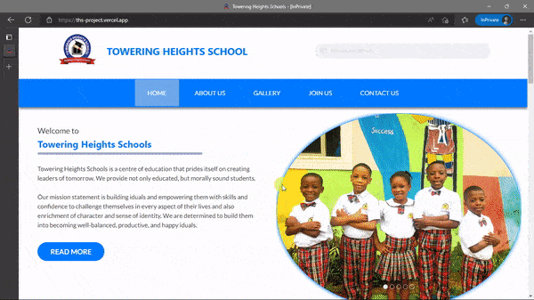

# Towering Heights Schools 🏫

Towering Heights Schools is a top educational institution that aims to provide a warm,safe and caring learning environment for all our pupils. A place where each boy and girl can feel empowered to explore ,grow and realise their full potential, nurtured and helped by expert practitioners who are passionate about their craft and committed to meeting the needs of the children in their care. Visit the website: 🔗 <a href="https://www.toweringheightsschools.com/">https://www.toweringheightsschools.com/</a>

## About Project 🚀

THS website was mainly developed with the following libaries and frameworks

<ul>
  <li>Next.js</li>
  <li>React.js</li>
  <li>TypeScript</li>
  <li>Chakra-UI</li>
</ul>

## Website Roadmap 🔍

Here are some of the links you should look out for easy navigation.

### Top links 🔗

<ul>
  <li>Home</li>
  <li>About Us</li>
  <li>Gallery</li>
  <li>Join Us</li>
    <ul>
      <li>Admissions</li>
      <li>Vacancies</li>
    </ul>
  <li>Contact Us</li>
</ul>

### Upcoming Links🔗

<ul>
  <li>About Us</li>
  <ul>
      <li>Blog</li>
    </ul>
  <li>Parent</li>
  <li>Teacher</li>
</ul>

## Designers 💄

<ol>
  <li><a href="https://github.com/celestinaa"> Bamisaye Anuoluwapo </a></li>
  <li><a href="https://github.com/Ennyhie"> Bolujokob Eniola </a></li>
  <li><a href="https://www.linkedin.com/in/gbajumo-islamiat/"> Gbajumo Islamiat </a></li>
</ol>

## Contributing 👨‍💻

Contributions will be **greatly appreciated**.

- If you would like to complain/suggest/contribute to this project, feel free to open an [issue](https://github.com/balotofi/toweringheights-frontend/issues)
- You can also open an issue with a tag.
- Please follow our [contributing guidelines](https://github.com/balotofi/toweringheights-frontend/blob/main/CONTRIBUTING.md).

Don't forget to give the project a star.⭐ Thanks.
